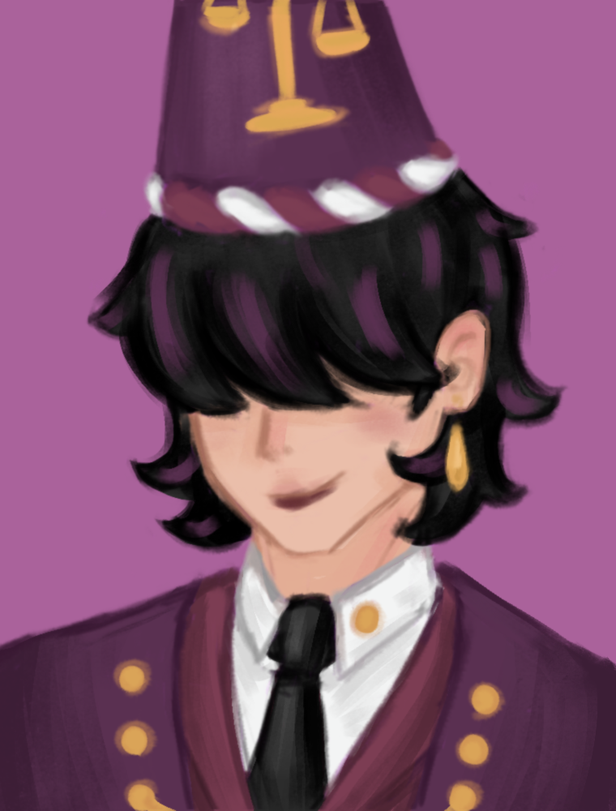

# slay-the-spire-mod-test
# The Lawyer — Slay the Spire 2 Mod



The Lawyer is a custom playable character for **Slay the Spire 2**. Build Evidence, expose weaknesses in the opposition, control the courtroom, and turn a strong case into decisive attacks.

> This mod is under active development. Card balance, artwork, animations, and compatibility may change between versions.

## Features

- A complete custom Lawyer character with a purple card pool and UI theme
- More than 50 custom Attack, Skill, and Power cards
- **Evidence**, a resource used to enable and strengthen Lawyer cards
- **Expose**, an enemy debuff consumed by friendly Attack hits to deal bonus damage
- Cards and Powers built around Evidence gain, spending, delayed returns, Weak, and Expose
- Custom starting deck, starting relic, energy counter, character art, and combat rig
- Basic multiplayer-aware targeting and ally interactions

## Core Mechanics

### Evidence

Evidence is the Lawyer's primary resource. Some cards generate or lose Evidence, while others spend it as an additional cost. Evidence gain and spending are separate events, allowing Powers such as Nathan, Kenny, and Courtroom Control to interact with them correctly.

### Expose

Expose is a stacking enemy debuff. Whenever an exposed enemy takes damage from a friendly Attack hit, one stack is consumed and the enemy takes 10 bonus damage. Multi-hit attacks can trigger multiple stacks, and attacks from allies can trigger it too.

## Requirements

- **Slay the Spire 2** version `0.107.0` or newer
- **BaseLib** version `3.3.6` or newer

The mod has been developed and tested with newer compatible BaseLib releases as well.

## Installation

1. Install BaseLib and make sure it is enabled.
2. Download the latest Lawyer mod release.
3. Create this folder if it does not already exist:

   ```text
   <Slay the Spire 2 installation>/mods/TestMod/
   ```

4. Place these files inside that folder:

   ```text
   TestMod.dll
   TestMod.json
   TestMod.pck
   ```

   `TestMod.pdb` is optional and is only useful for detailed debugging logs.

5. Start the game and enable the mod. BaseLib must load before TestMod.

Typical Windows Steam path:

```text
D:\SteamLibrary\steamapps\common\Slay the Spire 2\mods\TestMod
```

Do not copy the source-code folders into the game directory. The DLL contains the game logic, while the PCK contains images, scenes, and other Godot resources.

## Building from Source

Development requirements:

- .NET 9 SDK
- Godot `4.5.1-stable-mono`
- A local Slay the Spire 2 installation
- BaseLib NuGet dependency (`3.3.6`)

Restore and build the project:

```powershell
dotnet restore TestMod.csproj
dotnet build TestMod.csproj -c Release
```

The compiled DLL and PDB are written under:

```text
.godot/mono/temp/bin/Release/
```

Scenes and imported textures require a full Godot PCK export. From the project directory, run the Godot 4.5.1 Mono console executable:

```powershell
Godot_v4.5.1-stable_mono_win64_console.exe --headless --path . --export-pack BasicExport TestMod.pck
```

Do not export with a newer Godot version; the game may reject an incompatible PCK.

## Current Status

- The mod is playable but still experimental.
- Some artwork and Power icons may use placeholders.
- The first combat rig and animations are functional but still need visual polish.
- Multiplayer interactions, animation transitions, and unusual card/Power combinations may need additional in-game testing.
- Save compatibility is not guaranteed between development builds.

Bug reports are most useful when they include the game log, BaseLib version, reproduction steps, and a screenshot or video.

## 中文说明

Lawyer 是《Slay the Spire 2》的自定义律师角色模组。角色围绕 **Evidence（证据）** 和 **Expose（揭露）** 展开：收集或花费证据强化卡牌，并通过友方 Attack 命中消耗敌人的 Expose，造成额外伤害。

安装时需要 BaseLib `3.3.6` 或更高版本。将 `TestMod.dll`、`TestMod.json` 和 `TestMod.pck` 放入游戏的 `mods/TestMod` 文件夹即可；`TestMod.pdb` 仅用于调试。当前版本仍在开发中，数值、美术、动画以及存档兼容性都可能继续调整。

## Credits

- Character artwork: **Kaylee Kim**
- Mod author and character design: **SaltedFishyy**
- Framework: **BaseLib** by Alchyr and contributors
- Slay the Spire 2 is developed by Mega Crit

This is an unofficial fan-made mod and is not affiliated with or endorsed by Mega Crit.
